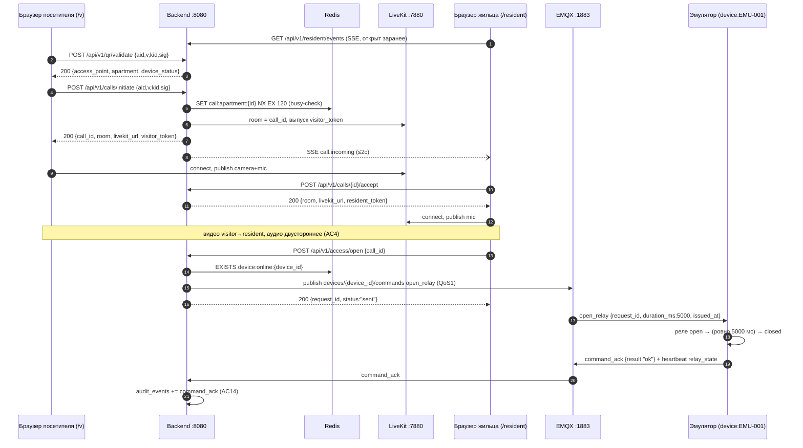

# API — Walking Skeleton (REST + SSE)

Backend: `http://localhost:8080`. Все ответы — JSON, время — UTC ISO 8601 (`Z`). Часть эндпоинтов защищена аутентификацией (JWT RS256) и RBAC — дизайн см. [auth.md](auth.md); ниже в сводке эндпоинтов колонка **Доступ** помечает каждый роут (`public` / `resident` / `admin`). Документ описывает намерение (написан до кода); UUID в примерах — канонические фикстуры из [architecture.md](architecture.md) и [auth.md](auth.md).

## Сводка эндпоинтов

| Метод | Путь | Доступ | Назначение | Успех | Ошибки |
|---|---|---|---|---|---|
| GET | `/health` | public | Живость сервиса + зависимости | 200 | — |
| POST | `/api/v1/qr/validate` | public | Валидация QR-параметров | 200 | 400 `INVALID_QR`, 400 `VALIDATION_ERROR` |
| POST | `/api/v1/calls/initiate` | public | Начать звонок (комната LiveKit + токен посетителя) | 200 | 400 `INVALID_QR`, 409 `CALL_IN_PROGRESS` |
| POST | `/api/v1/calls/{id}/cancel` | public | Посетитель отменяет звонок (capability по `call_id`) | 204 | 404 `CALL_NOT_FOUND` |
| POST | `/api/v1/calls/{id}/end` | public | Завершить звонок (любая сторона, capability по `call_id`) | 204 | 404 `CALL_NOT_FOUND` |
| POST | `/api/v1/auth/otp/send` | public | Жилец/владелец: запрос SMS-OTP на телефон | 200 | 400 `VALIDATION_ERROR`, 429 `RATE_LIMIT` |
| POST | `/api/v1/auth/otp/verify` | public | Жилец/владелец: проверка OTP → выдача токенов | 200 | 401 `UNAUTHORIZED`, 429 `RATE_LIMIT` |
| POST | `/api/v1/auth/admin/login` | public | УК-админ: email+пароль+TOTP → выдача токенов | 200 | 401 `UNAUTHORIZED`, 429 `RATE_LIMIT` |
| POST | `/api/v1/auth/refresh` | public (по refresh-cookie) | Ротация: refresh-cookie → новый access + refresh | 200 | 401 `UNAUTHORIZED` |
| POST | `/api/v1/auth/logout` | public (по refresh-cookie) | Отзыв refresh (DEL whitelist) + очистка cookie | 204 | — |
| GET | `/api/v1/auth/me` | authn (любой kind) | Профиль текущего пользователя | 200 | 401 `UNAUTHORIZED` |
| POST | `/api/v1/calls/{id}/accept` | resident | Жилец/владелец принимает звонок | 200 | 401 `UNAUTHORIZED`, 403 `FORBIDDEN`, 404 `CALL_NOT_FOUND` |
| POST | `/api/v1/access/open` | resident | Команда открытия двери (только после accept) | 200 | 401 `UNAUTHORIZED`, 403 `FORBIDDEN`, 404 `CALL_NOT_FOUND`, 409 `CALL_NOT_ACCEPTED`, 503 `DEVICE_OFFLINE` |
| GET | `/api/v1/resident/events` | resident (токен в `?token=`) | SSE-поток событий жильца | 200 (stream) | 401 `UNAUTHORIZED` |
| GET | `/api/v1/devices` | admin | Список устройств со статусом (скоуп по `mc_id`) | 200 | 401 `UNAUTHORIZED`, 403 `FORBIDDEN` |
| GET | `/api/v1/audit/events?limit=N` | admin | Последние события аудита (скоуп по `mc_id`) | 200 | 401 `UNAUTHORIZED`, 403 `FORBIDDEN` |
| POST | `/api/v1/auth/invite/accept` | public | Приём инвайт-ссылки: привязка + вход (новому — без OTP) | 200 | 400 `VALIDATION_ERROR`, 404 `INVITE_INVALID`, 410 `INVITE_EXPIRED`, 429 `RATE_LIMIT` |
| POST | `/api/v1/admin/owners` | admin | УК создаёт владельца квартиры + опц. гранты на точки → инвайт-ссылка | 201 | 400 `VALIDATION_ERROR`, 401, 403 |
| POST | `/api/v1/admin/access-grants` | admin | УК выдаёт доступ на калитку/шлагбаум (грант или инвайт) | 200 / 201 | 400 `VALIDATION_ERROR`, 401, 403 |
| GET | `/api/v1/admin/residents` | admin | Жильцы/владельцы своей УК (скоуп по `mc_id`) | 200 | 401, 403 |
| GET | `/api/v1/admin/catalog` | admin | Дерево дом→подъезд→квартира + точки gate/barrier своей УК | 200 | 401, 403 |
| GET | `/api/v1/admin/sites` | admin | Объекты своей УК (выпадашка консоли) | 200 | 401, 403 |
| GET | `/api/v1/admin/sites/{site_id}/matrix` | admin | Матрица доступа объекта (владельцы × точки + гранты) | 200 | 400, 401, 403 |
| GET | `/api/v1/admin/apartments/{apartment_id}/residents` | admin | Жильцы квартиры + их гранты (раскрытие строки) | 200 | 400, 401, 403 |
| PUT | `/api/v1/admin/users/{user_id}/grants/{point_public_id}` | admin | Выдать грант на точку (тогл матрицы) | 200 | 400, 401, 403 |
| DELETE | `/api/v1/admin/users/{user_id}/grants/{point_public_id}` | admin | Отозвать грант | 200 | 400, 401, 403 |
| POST | `/api/v1/apartments/{apartment_id}/residents/invite` | resident (владелец) | Владелец приглашает жильца в СВОЮ квартиру | 201 | 400 `VALIDATION_ERROR`, 401, 403 `FORBIDDEN` |
| GET | `/api/v1/access/points` | resident | Точки с постоянным грантом + online-статус | 200 | 401 `UNAUTHORIZED` |
| POST | `/api/v1/access/open-point` | resident | Прямое открытие калитки/шлагбаума по гранту (без звонка) | 200 | 400, 401, 403 `FORBIDDEN`, 503 `DEVICE_OFFLINE` |
| GET | `/api/v1/apartments/{apartment_id}/guest-points` | resident | Точки, которые создатель вправе дать гостю | 200 | 401, 403 |
| POST | `/api/v1/apartments/{apartment_id}/guests` | resident | Создать гостя (окно ≤2д, набор точек) → ссылка `/g/{token}` | 201 | 400, 401, 403 |
| GET | `/api/v1/apartments/{apartment_id}/guests` | resident | Свои гости создателя (без токенов) | 200 | 401 |
| POST | `/api/v1/guests/{guest_id}/revoke` | resident | Отозвать гостя (создатель или владелец квартиры) | 200 | 401, 404 `GUEST_INVALID` |
| PUT | `/api/v1/apartments/{apartment_id}/residents/{user_id}/guest-permission` | resident (владелец) | Делегировать жильцу право создавать гостей | 200 | 400, 401, 403 |
| GET | `/api/v1/g/{token}` | public | Гостевая страница: имя, окно, точки + online | 200 | 404 `GUEST_INVALID`, 410 `GUEST_EXPIRED` |
| POST | `/api/v1/g/{token}/open` | public | Открытие точки гостем (в окне + производный доступ) | 200 | 400, 403 `FORBIDDEN`, 404/410, 503 `DEVICE_OFFLINE` |
| GET | `/api/v1/system/management-companies` | system | Список УК со счётчиками | 200 | 401, 403 |
| POST | `/api/v1/system/management-companies` | system | Создать УК | 201 | 400, 401, 403 |
| POST | `/api/v1/system/management-companies/{mc_id}/admins` | system | Создать УК-админа (otpauth один раз) | 201 | 400, 401, 403 |
| GET | `/api/v1/system/management-companies/{mc_id}/catalog` | system | Дерево объект→дом→подъезд УК | 200 | 401, 403 |
| POST | `/api/v1/system/sites` | system | Создать объект (ЖК/standalone) | 201 | 400, 401, 403 |
| POST | `/api/v1/system/buildings` | system | Создать дом в объекте | 201 | 400, 401, 403 |
| POST | `/api/v1/system/entrances` | system | Создать подъезд в доме | 201 | 400, 401, 403 |
| PATCH | `/api/v1/system/buildings/{building_id}` | system | Перевесить дом на другой объект своей УК | 200 | 400, 401, 403 |

**Доступ:** `public` — без токена (публичные POST под лимитером `publicRL` 30 req/мин на IP: `qr/validate`, `calls/initiate`, `calls/{id}/cancel`, `calls/{id}/end`); `/auth/*` — публичные, но со своими лимитерами (см. [auth.md](auth.md)). `resident` — требуется валидный access-JWT с `kind ∈ {resident, owner}` (middleware `RequireResident`) + доменная проверка принадлежности к квартире на `accept`/`access/open`. `admin` — `kind = mc_admin` (middleware `RequireAdmin`), выборки ограничены `management_company_id` из claims. `authn` — любой валидный токен без ограничения роли.

> **Изменение контракта (инкремент auth):** `POST /calls/{id}/accept` и `POST /access/open` переехали из публичных в **resident-only**; `access/open` при этом уходит из-под лимитера `publicRL`. `cancel`/`end` остаются публичными — правом на них владеет любой, кто знает `call_id` (capability-модель, ТЗ §5.6): у посетителя нет аккаунта.

## Формат ошибок (ТЗ §13.1)

Единый конверт для всех ошибок:

```json
{
  "error": {
    "code": "DEVICE_OFFLINE",
    "message": "Device is offline, door cannot be opened remotely",
    "request_id": "9c1b7a3e-5f20-4d55-8b1a-2e6f0c4d7a91"
  }
}
```

| Код | HTTP | Когда |
|---|---|---|
| `INVALID_QR` | 400 | Битая/чужая подпись, неизвестный `kid`, неактивная точка, неизвестный `aid` |
| `VALIDATION_ERROR` | 400 | Некорректное тело запроса (отсутствуют обязательные поля и т.п.) |
| `CALL_NOT_FOUND` | 404 | `call_id` не существует или сессия истекла (TTL 120с) |
| `CALL_NOT_ACCEPTED` | 409 | Открытие двери до того, как жилец принял звонок (сессия в состоянии `ringing`). Дверь открывается только после `accept` (security M1) |
| `CALL_IN_PROGRESS` | 409 | Квартира занята другим активным звонком |
| `DEVICE_OFFLINE` | 503 | Прямое открытие невозможно: нет presence-ключа устройства. Для сценария **звонка** offline не блокирует — только warning (ТЗ §5.4, §13.4) |
| `UNAUTHORIZED` | 401 | Токен отсутствует / просрочен / невалидная подпись; неверный OTP; неверные креды или TOTP админа; refresh не в whitelist (reuse/отозван) |
| `FORBIDDEN` | 403 | Токен валиден, но роли недостаточно (`RequireResident`/`RequireAdmin`) либо пользователь не привязан к целевой квартире (проверка apartment-membership на `accept`/`access/open`) |
| `RATE_LIMIT` | 429 | Превышен лимит частоты. Публичные POST под `publicRL` (30 req/мин на IP): `qr/validate`, `calls/initiate`, `calls/{id}/cancel`, `calls/{id}/end` (ТЗ §5.6). Отдельные лимитеры у `/auth/otp/*`, `/auth/admin/login` и `/auth/invite/accept` (10 req/мин на IP) |
| `INVITE_INVALID` | 404 | Инвайт-токен не найден, уже использован, либо его телефон принадлежит УК-админу (отказ маскируется под «не найден») |
| `INVITE_EXPIRED` | 410 | Инвайт просрочен (TTL 7 дней). 410 Gone — ресурс существовал, но истёк |
| `GUEST_INVALID` | 404 | Гостевой токен `/g/{token}` не найден/чужой (единый ответ, без различения) |
| `GUEST_EXPIRED` | 410 | Гость вне окна `valid_from..valid_to` или отозван |
| `INTERNAL` | 500 | Необработанная ошибка сервера |

`request_id` в конверте — идентификатор HTTP-запроса для корреляции с логами (не путать с `request_id` MQTT-команды).

**Алиасы ТЗ §13.4.** ТЗ упоминает коды `TOKEN_EXPIRED` и `ACCESS_DENIED`. В реализации они **не выделяются** отдельно: просроченный/невалидный токен → `UNAUTHORIZED` (401), отказ по роли/принадлежности → `FORBIDDEN` (403). Т.е. `TOKEN_EXPIRED` — частный случай `UNAUTHORIZED`, `ACCESS_DENIED` — синоним `FORBIDDEN`. Клиент различает истечение токена по HTTP-статусу 401 и запускает single-flight refresh (см. [auth.md](auth.md)).

## Аутентификация

Дизайн, модель ролей, потоки и жизненный цикл токенов — в [auth.md](auth.md). Здесь — контракт HTTP.

**Токены.** Access — JWT RS256, TTL 15 мин, stateless, передаётся в заголовке `Authorization: Bearer <access>`. Refresh — JWT RS256, TTL 30 дней, живёт в whitelist Redis (`auth:refresh:{jti}`), клиенту отдаётся **только** как HttpOnly-cookie и в теле ответов не фигурирует.

**Refresh-cookie** (ставится на `otp/verify`, `admin/login`, `refresh`):

```
Set-Cookie: refresh_token=<JWT>; HttpOnly; Secure; SameSite=Strict; Path=/api/v1/auth; Max-Age=2592000
```

`Path=/api/v1/auth` — cookie уходит только на auth-эндпоинты. `logout` очищает её (`Max-Age=0`).

**Claims access-токена** (см. [auth.md](auth.md) §JWT):

```json
{
  "sub": "77777777-7777-7777-7777-777777777777",
  "kind": "resident",
  "roles": [
    { "apartment_id": "33333333-3333-3333-3333-333333333333", "role": "resident", "can_create_guests": false }
  ],
  "mc_id": null,
  "jti": "…",
  "iat": 1752300000,
  "exp": 1752300900,
  "typ": "access"
}
```

У `mc_admin` массив `roles` пуст, а `mc_id` = UUID управляющей компании. `typ` различает `access` и `refresh`.

### POST /api/v1/auth/otp/send

Жилец/владелец запрашивает OTP-код на телефон. Лимиты: не более 3 запросов на телефон за 10 мин, иначе 429 (см. [auth.md](auth.md) §OTP-лимиты). В dev-режиме код возвращается в поле `dev_code` (в проде поля нет — код уходит по SMS).

Запрос:

```json
{ "phone": "+77010000001" }
```

Ответ 200 (dev):

```json
{ "sent": true, "dev_code": "123456" }
```

Ответ 429 — `RATE_LIMIT` (лимит запросов или телефон во временной блокировке).

### POST /api/v1/auth/otp/verify

Проверка OTP. Успех → выдача пары токенов. Неверный код → 401; на 5-й неверной попытке телефон блокируется на 30 мин (ТЗ §12.4).

Запрос:

```json
{ "phone": "+77010000001", "code": "123456" }
```

Ответ 200 (+ `Set-Cookie: refresh_token=…`):

```json
{
  "access_token": "<JWT RS256>",
  "token_type": "Bearer",
  "expires_in": 900,
  "user": {
    "id": "77777777-7777-7777-7777-777777777777",
    "kind": "resident",
    "apartments": [ { "id": "33333333-3333-3333-3333-333333333333", "role": "resident" } ],
    "mc_id": null
  }
}
```

Ответ 401 — `UNAUTHORIZED` (нет активного OTP / неверный код / телефон заблокирован); 429 — `RATE_LIMIT`.

### POST /api/v1/auth/admin/login

УК-админ: email + пароль (bcrypt) + TOTP-код (2FA). Все три обязательны; при любой ошибке — единый 401 без раскрытия, что именно не совпало.

Запрос:

```json
{ "email": "admin@demo.example", "password": "admin-demo-123", "totp_code": "000000" }
```

Ответ 200 (+ `Set-Cookie: refresh_token=…`) — та же форма, что у `otp/verify`, `kind` = `mc_admin`, `mc_id` заполнен:

```json
{
  "access_token": "<JWT RS256>",
  "token_type": "Bearer",
  "expires_in": 900,
  "user": {
    "id": "99999999-9999-9999-9999-999999999999",
    "kind": "mc_admin",
    "apartments": [],
    "mc_id": "11111111-1111-1111-1111-111111111111"
  }
}
```

Ответ 401 — `UNAUTHORIZED` (неверный email/пароль/TOTP); 429 — `RATE_LIMIT`.

### POST /api/v1/auth/refresh

Тела нет — refresh берётся из HttpOnly-cookie. Ротация (ТЗ §13.4, [auth.md](auth.md) §refresh): проверка `jti` в whitelist → `DEL` старого → выдача новой пары → `SET` нового `jti`. Отправка украденного/уже использованного refresh (его `jti` уже удалён) → 401. Redis недоступен → fail-closed (401).

Ответ 200 (+ новый `Set-Cookie: refresh_token=…`):

```json
{ "access_token": "<JWT RS256>", "token_type": "Bearer", "expires_in": 900 }
```

Ответ 401 — `UNAUTHORIZED` (нет cookie / `jti` не в whitelist / истёк / Redis недоступен).

### POST /api/v1/auth/logout

Отзывает refresh: `DEL auth:refresh:{jti}` и очистка cookie. Идемпотентно. Access-токены остаются валидными до истечения их 15-мин TTL (stateless — не отзываются).

Ответ **204 No Content** (+ `Set-Cookie: refresh_token=; Max-Age=0`).

### GET /api/v1/auth/me

Требует `Authorization: Bearer <access>`. Возвращает профиль из claims (без похода в БД).

Ответ 200:

```json
{
  "id": "77777777-7777-7777-7777-777777777777",
  "kind": "resident",
  "apartments": [ { "id": "33333333-3333-3333-3333-333333333333", "role": "resident" } ],
  "mc_id": null
}
```

Ответ 401 — `UNAUTHORIZED` (нет/невалиден/просрочен токен).

## Эндпоинты

### GET /health

AC1: 200, пока жив процесс; деградация видна по `deps`.

```json
{
  "status": "ok",
  "deps": { "postgres": "ok", "redis": "ok", "mqtt": "ok", "livekit": "ok" }
}
```

### POST /api/v1/qr/validate

Проверка HMAC-подписи: `message = aid + ":" + v + ":" + kid`, `sig = base64url(HMAC-SHA256(message, secret[kid]))[0:32]` (ТЗ §5.3). Сравнение — константное по времени.

Запрос:

```json
{
  "aid": "55555555-5555-5555-5555-555555555555",
  "v": "1",
  "kid": "dev1",
  "sig": "oRnZ1qQnxcI1GrLWAmBYrmVIH__CG-K6"
}
```

Ответ 200 (устройство online):

```json
{
  "access_point": { "public_id": "55555555-5555-5555-5555-555555555555", "label": "Подъезд №1" },
  "apartment": { "id": "33333333-3333-3333-3333-333333333333", "number": "1" },
  "device_status": "online"
}
```

Ответ 200 (устройство offline — E1; звонок НЕ блокируется):

```json
{
  "access_point": { "public_id": "55555555-5555-5555-5555-555555555555", "label": "Подъезд №1" },
  "apartment": { "id": "33333333-3333-3333-3333-333333333333", "number": "1" },
  "device_status": "offline",
  "warning": "Устройство временно недоступно. Вы можете позвонить жильцу — он откроет дверь, когда связь восстановится."
}
```

Ответ 400 — `INVALID_QR` (E6). Причина (битая подпись / неизвестный kid / неактивная точка) не раскрывается клиенту, пишется только в лог backend (`qr_validation_failed`).

### POST /api/v1/calls/initiate

Повторяет валидацию QR (не доверяет клиенту), затем: busy-check квартиры (Redis `SET NX EX 120`), создание LiveKit-комнаты `room = call_id`, выпуск токена посетителя (granты: publish camera+mic — ТЗ §6.1), сигнал жильцу через SSE ≤2с (AC3). Аудит: `call_initiated`.

Запрос — тот же, что у `qr/validate`:

```json
{
  "aid": "55555555-5555-5555-5555-555555555555",
  "v": "1",
  "kid": "dev1",
  "sig": "oRnZ1qQnxcI1GrLWAmBYrmVIH__CG-K6"
}
```

Ответ 200:

```json
{
  "call_id": "b7e2a4c8-1f3d-4e5a-9c6b-8d7f0a1b2c3d",
  "room": "b7e2a4c8-1f3d-4e5a-9c6b-8d7f0a1b2c3d",
  "livekit_url": "ws://localhost:7880",
  "visitor_token": "<LiveKit JWT>",
  "device_status": "online"
}
```

Ответ 409 — `CALL_IN_PROGRESS` (E5): квартира занята активным звонком (ключ `call:apartment:{apartment_id}` существует в Redis).

### POST /api/v1/calls/{id}/accept

Жилец принимает звонок. Выпускается токен жильца (гранты: publish **только mic**, subscribe — ТЗ §6.1). Остальным подписчикам SSE уходит `call.accepted`. Аудит: `call_accepted`.

Ответ 200:

```json
{
  "room": "b7e2a4c8-1f3d-4e5a-9c6b-8d7f0a1b2c3d",
  "livekit_url": "ws://localhost:7880",
  "resident_token": "<LiveKit JWT>"
}
```

Ответ 404 — `CALL_NOT_FOUND`: неизвестный `call_id` или сессия истекла.

### POST /api/v1/calls/{id}/cancel • POST /api/v1/calls/{id}/end

`cancel` — посетитель отменил до ответа (жильцу уходит SSE `call.cancelled`); `end` — завершение установленного звонка любой стороной. Оба: **204 No Content**, комната LiveKit закрывается, busy-ключ квартиры снимается. 404 — `CALL_NOT_FOUND`.

### GET /api/v1/resident/events (SSE)

`Content-Type: text/event-stream`. В skeleton поток отдаёт события единственной захардкоженной квартиры (без auth). Реализация backend — за интерфейсом `Notifier` (см. [architecture.md](architecture.md)). Keep-alive: комментарий `: ping` каждые 15с. Переигровка пропущенных событий (`Last-Event-ID`) не поддерживается — клиент после реконнекта опирается на текущее состояние.

```
: ping

event: call.incoming
data: {"call_id":"b7e2a4c8-1f3d-4e5a-9c6b-8d7f0a1b2c3d","access_point_label":"Подъезд №1","apartment_id":"33333333-3333-3333-3333-333333333333"}

event: call.cancelled
data: {"call_id":"b7e2a4c8-1f3d-4e5a-9c6b-8d7f0a1b2c3d"}

event: call.accepted
data: {"call_id":"b7e2a4c8-1f3d-4e5a-9c6b-8d7f0a1b2c3d"}
```

| Событие | Payload | Когда |
|---|---|---|
| `call.incoming` | `{call_id, access_point_label, apartment_id}` | Посетитель инициировал звонок (≤2с от initiate — AC3) |
| `call.cancelled` | `{call_id}` | Посетитель отменил / сессия истекла |
| `call.accepted` | `{call_id}` | Звонок принят (для остальных открытых вкладок жильца) |

### POST /api/v1/access/open

Проверки: звонок существует и активен (иначе 404), presence устройства в Redis (иначе 503 — AC12). Затем publish MQTT-команды `open_relay` в `devices/{device_id}/commands` (QoS1, payload — см. [firmware/docs/PROTOCOL.md](../../firmware/docs/PROTOCOL.md)); актуация ≤1с (AC5). Аудит: `door_open_requested`; при получении подтверждения устройства — `command_ack`.

Запрос:

```json
{ "call_id": "b7e2a4c8-1f3d-4e5a-9c6b-8d7f0a1b2c3d" }
```

Ответ 200 (`request_id` — UUID MQTT-команды, по нему матчится `command_ack` в аудите):

```json
{ "request_id": "7f9c24e5-0d2b-4a1a-9b6e-3f8a2c5d1e07", "status": "sent" }
```

Ответ 503 — `DEVICE_OFFLINE` (E1); ответ 404 — `CALL_NOT_FOUND`; ответ 409 — `CALL_NOT_ACCEPTED`, если звонок ещё не принят жильцом (сессия в состоянии `ringing`). Дверь открывается только после `POST /calls/{id}/accept` — это гарантирует, что доступом управляет жилец, а не владелец QR (security M1).

### GET /api/v1/devices

`status` — производное от Redis-presence (`device:online:{id}`, TTL 90с — AC9), не колонка БД.

```json
{
  "devices": [
    {
      "id": "66666666-6666-6666-6666-666666666666",
      "serial": "EMU-001",
      "access_point_id": "44444444-4444-4444-4444-444444444444",
      "type": "emulator",
      "firmware_version": "emu-0.1.0",
      "status": "online",
      "last_seen_at": "2026-07-07T10:00:00Z"
    }
  ]
}
```

### GET /api/v1/audit/events?limit=N

Последние события append-only таблицы `audit_events`, новые первыми. `limit` — по умолчанию 50, максимум 500. Минимальный набор событий skeleton (AC14): `call_initiated`, `call_accepted`, `door_open_requested`, `command_ack`, `fail_open_activated` (+ `fail_open_deactivated`, `call_cancelled`, `call_ended`, `command_rejected`).

```json
{
  "events": [
    {
      "id": 42,
      "event_type": "command_ack",
      "occurred_at": "2026-07-07T10:00:01Z",
      "actor": "device:EMU-001",
      "apartment_id": "33333333-3333-3333-3333-333333333333",
      "access_point_id": "44444444-4444-4444-4444-444444444444",
      "device_id": "66666666-6666-6666-6666-666666666666",
      "call_id": "b7e2a4c8-1f3d-4e5a-9c6b-8d7f0a1b2c3d",
      "request_id": "7f9c24e5-0d2b-4a1a-9b6e-3f8a2c5d1e07",
      "management_company_id": "11111111-1111-1111-1111-111111111111",
      "metadata": { "result": "ok" }
    }
  ]
}
```

## Онбординг и гранты доступа (инкремент онбординга)

Кто кого заводит (утверждённая модель): **УК** создаёт **владельцев** и раздаёт доступ на **калитки/шлагбаумы**, видит всех жильцов своей УК, но жильцов НЕ создаёт. **Владелец** создаёт/приглашает **жильцов** в свою квартиру.

**Доставка инвайта — самим создателем (целевой дизайн, не заглушка).** По утверждённому с заказчиком решению приглашающий (УК-админ в консоли, владелец в приложении) получает готовую секрет-ссылку в ответе API и **сам** пересылает её адресату любым каналом (SMS, WhatsApp, Telegram, вручную). Поэтому серверная интеграция с провайдером рассылки не нужна — это не прод-гэп, а сознательное упрощение канала доставки.

**Инвайт-токен.** 32 байта `crypto/rand` → base64url (43 симв.). В БД хранится ТОЛЬКО `sha256(token)` — секрет невосстановим. TTL 7 дней, одноразовый (атомарный `used_at`: проигрыш гонки → `INVITE_INVALID`). Ссылка: `{VISITOR_BASE_URL}/invite/{token}`.

> **Резидентский UI — мобильное приложение (ТЗ §14), не веб.** На вебе живёт только УК-консоль (`/admin`). Приём инвайта, `access/points`, `open-point`, приглашение жильца — API, потребитель — мобильный клиент (iOS/Android). Для шлагбаумов QR не используется — управление только из приложения (ТЗ §4.6, §4.7).

### POST /api/v1/auth/invite/accept

Публичный (лимитер 10 req/мин на IP). Тело: `{"token": "<секрет из ссылки>"}`.

Поведение зависит от того, существует ли уже пользователь с телефоном инвайта:

| Случай | Ответ |
|---|---|
| Пользователь **новый** (создан этим приёмом) | 200 — как `otp/verify`: `access_token` + профиль + refresh-cookie. **Вход без OTP** |
| Пользователь **уже существует** | 200 `{"linked": true, "login_required": true}` — привязка/грант созданы, но **сессия НЕ выдаётся**; вход обычным OTP |

**Почему так (security, этап 6).** Bearer-ссылка = вход без подтверждения телефона. Для нового пользователя красть нечего. Для существующего выдача сессии означала бы: кто угодно, зная телефон, выпускает себе сессию за чужого жильца со всеми его ролями (в т.ч. в других УК). Поэтому auto-login — только новым.

Дополнительно: телефон, принадлежащий **`mc_admin`**, инвайтом не принимается (иначе приём выпускал бы админский токен — эскалация привилегий, в т.ч. на чужую УК). Ответ маскируется под `INVITE_INVALID`.

### POST /api/v1/admin/owners

Admin. Тело: `{"apartment_id": "<uuid>", "phone": "+7…", "full_name": "Иванов И.И.", "access_point_public_ids": ["<uuid>", …]}`.
- `full_name` — **обязательна** (ФИО адресата).
- `access_point_public_ids` — опциональный список точек `gate`/`barrier` своей УК: **композитный инвайт** (одна ссылка = квартира + N доступов). Кэп ≤ 20, дубли схлопываются; каждая точка валидируется (чужая/не gate-barrier → `VALIDATION_ERROR`, инвайт не создаётся).

Квартира должна принадлежать УК админа (иначе — `VALIDATION_ERROR "Apartment not found"`, неотличимо от несуществующей: закрыт enumeration чужих объектов).

```json
{ "invite": { "token": "vLiJJUx-aN8-…", "url": "http://localhost:5173/invite/vLiJJUx-aN8-…", "expires_at": "2026-07-20T17:36:47Z" } }
```

Приём такого инвайта существующим жильцом квартиры **повышает** его роль до `owner` (и `users.kind`) и выдаёт выбранные гранты; жилецкий инвайт владельца не понижает. `full_name` пользователю дозаполняется, только если было пусто (непустое не перезатирается).

### POST /api/v1/admin/access-grants

Admin. Тело: `{"access_point_public_id": "<uuid>", "phone": "+7…", "full_name": "Иванов И.И."}` (`full_name` обязательна). Точка обязана быть типа `gate`/`barrier` и принадлежать УК админа.

- Пользователь **уже в этой УК** (есть роль или грант) → грант выдаётся сразу: **200** `{"granted": true, "user_id": "…", "access_point_public_id": "…"}`.
- Иначе → **201** `{"granted": false, "invite": { … }}`.

Грант не выдаётся «постороннему» без активации инвайта — иначе admin мог бы привязать доступ к произвольному чужому аккаунту.

### GET /api/v1/admin/residents

Admin. Все жильцы/владельцы своей УК (скоуп по `mc_id` из claims), с квартирами и грантами.

```json
{
  "residents": [
    {
      "user_id": "1f87d09e-…",
      "phone": "+77010000012",
      "full_name": "Иванов Иван Иванович",
      "kind": "resident",
      "apartments": [],
      "grants": [{ "public_id": "eeeeeeee-…", "label": "Калитка двора" }]
    }
  ]
}
```

### GET /api/v1/admin/catalog

Admin. Дерево объектов своей УК (скоуп по `mc_id`) для выпадашек формы создания владельца/грантов — вместо ручного ввода UUID.

```json
{
  "buildings": [
    { "id": "2222…", "address": "ул. Демонстрационная, 1",
      "entrances": [ { "id": "a0a0…", "number": "1",
        "apartments": [ { "id": "3333…", "number": "1" } ] } ] }
  ],
  "points": [ { "public_id": "eeee…", "label": "Калитка двора", "type": "gate" } ]
}
```

Квартиры без подъезда (`entrance_id IS NULL`) группируются под записью с `id: ""` (back-compat).

### POST /api/v1/apartments/{apartment_id}/residents/invite

Resident-группа + доменная проверка **ownership**: приглашать вправе только владелец ЭТОЙ квартиры (роль `owner` с этим `apartment_id` в claims). Жилец той же квартиры, владелец другой квартиры и `mc_admin` → `403 FORBIDDEN`. Тело: `{"phone": "+7…", "full_name": "Иванов И.И."}` (оба обязательны) → 201 `{ "invite": { … } }`.

### GET /api/v1/access/points

Resident. Точки, на которые у пользователя есть постоянный грант, + online-статус устройства.

```json
{ "points": [ { "public_id": "eeeeeeee-…", "label": "Калитка двора", "type": "gate", "online": true } ] }
```

### POST /api/v1/access/open-point

Resident. Тело: `{"public_id": "<uuid точки>"}`. Прямое открытие калитки/шлагбаума **по гранту, без звонка** (ТЗ §4.7): нет гейта `accept` (M1) — право даёт сам грант.

- нет гранта на эту точку → `403 FORBIDDEN` (`"You do not have access to this point"`);
- устройство offline → `503 DEVICE_OFFLINE` (команда не публикуется);
- успех → `200 {"request_id": "…", "status": "sent"}` + MQTT `open_relay` + аудит `door_open_requested`.

**Нормализация телефона.** Все телефоны приводятся к `+<цифры>` (разделители выбрасываются, локальная `8XXXXXXXXXX` → `+7…`): `8 (701) 000-00-10` и `+77010000010` — один и тот же пользователь.

**Аудит онбординга:** `invite_created`, `invite_accepted`, `access_grant_created` (+ `door_open_requested` на открытии точки). Секрет-токены в аудит и логи не попадают.

## Гостевой доступ (инкремент B, ТЗ §2.2.8 / §3.1.5 / §4.6)

Временный доступ для гостя **без аккаунта** по ссылке `/g/{token}`, ограниченный окном ≤ 2 дней. Гостей создаёт владелец или жилец с правом `can_create_guests` (делегируется владельцем). Гость — веб-клиент (ТЗ §86: гость = браузер), поэтому страница `/g/{token}` реализована на вебе; создание гостя — API-first (у создателя в проде — мобильное приложение).

**Токен гостя** — как инвайт: 32 байта `crypto/rand` → base64url, в БД только `sha256`. Аутентификация — bearer-capability ссылки (риск принят заказчиком 2026-07-06); митигации: TTL ≤ 2 дней, отзыв, `Cache-Control: no-store` + `Referrer-Policy: no-referrer` на `/g/*`, `POST /g/{token}/open` под лимитом 10/мин, токен в аудит/логи не попадает (в событиях — `guest_id`).

**Производный доступ (ключевое).** Гость получает только точки, доступные САМОМУ создателю: подъезд(ы) его квартиры (по членству) + калитки/шлагбаумы, на которые у создателя есть `user_access_grants`. Право проверяется **на каждом открытии заново**: подъезд — создатель ещё член квартиры; gate/barrier — у создателя ещё есть грант. **УК изъяла грант у владельца → гость мгновенно теряет эту точку** (проверено вживую). Отзыв `can_create_guests` уже созданных гостей НЕ убивает (право управляет созданием, не жизнью).

### POST /api/v1/apartments/{apartment_id}/guests

Resident + право (`owner` ИЛИ `can_create_guests`, проверяется по БД — свежее делегирование действует сразу). Тело: `{"full_name": "Гость", "valid_hours": 24, "access_point_public_ids": ["<uuid>", …]}`.
- `valid_hours` — окно от `now`, > 0 и ≤ 48 (иначе `VALIDATION_ERROR`).
- точки обязаны быть ⊆ доступных создателю (иначе `FORBIDDEN`), ≥ 1.

```json
{ "guest_id": "a16f…", "token": "Fvph…", "url": "http://localhost:5173/g/Fvph…",
  "valid_from": "2026-07-16T11:15:57Z", "valid_to": "2026-07-17T11:15:57Z" }
```

Доставка — самим создателем (копирует `url` и шлёт гостю), как у инвайтов.

### GET /api/v1/g/{token} · POST /api/v1/g/{token}/open

Публичные. `GET` → `{guest_name, valid_from, valid_to, points:[{public_id,label,type,online}]}` (невалидный → 404 `GUEST_INVALID`; вне окна/отозван → 410 `GUEST_EXPIRED`). `POST …/open {public_id}` → открывает точку (окно → производный доступ → presence → MQTT `open_relay`, та же машинерия, что `access/open-point`); точка вне набора или доступ создателя утрачен → `403 FORBIDDEN`; устройство offline → `503`.

### Управление и делегирование

`GET /apartments/{id}/guest-points` — точки для формы. `GET /apartments/{id}/guests` — свои гости создателя (без токенов). `POST /guests/{guest_id}/revoke` — отзыв (создатель или владелец квартиры). `PUT /apartments/{id}/residents/{user_id}/guest-permission {enabled}` — владелец делегирует жильцу своей квартиры право создавать гостей.

**Аудит гостей:** `guest_created`, `guest_revoked`, `guest_right_changed` (+ `door_open_requested` с `actor="guest:{id}"` на открытии). Курьеры (ТЗ §2.2.9) — отложены.

## Матрица доступа УК-консоли (инкремент D)

Редизайн УК-консоли под управление доступами на калитки/шлагбаумы. Всё скоупится по `mc_id` из claims.
- `GET /admin/sites` — объекты своей УК (выпадашка в шапке).
- `GET /admin/sites/{site_id}/matrix` → `{points:[{public_id,label,type}], owners:[{user_id,full_name,phone,apartments:[{id,number}],grants:[public_id]}]}`. Столбцы — калитки/шлагбаумы объекта, строки — владельцы (последний добавленный сверху). Чужой объект → `VALIDATION_ERROR "Site not found"`.
- `GET /admin/apartments/{apartment_id}/residents` — жильцы квартиры + их гранты на точки объекта (ленивое раскрытие строки владельца).
- **Тогл гранта:** `PUT /admin/users/{user_id}/grants/{point_public_id}` (выдать) / `DELETE …` (отозвать). Идемпотентны (повтор — тот же результат, без дубля аудита). Точка резолвится по `public_id` **с фильтром `mc` + тип gate/barrier**; пользователь обязан принадлежать УК (роль или грант), иначе `FORBIDDEN`. Аудит `access_grant_created`/`access_grant_revoked` (`via: matrix`) только при реальном изменении.

Эффект отзыва мгновенный: `ResolveGrantedPoint`/`OpenPoint` читают таблицу вживую, производный гостевой доступ схлопывается автоматически. **Отзыв гранта — новая операция инкремента D** (ранее был только выпуск).

## Платформенная админка (инкремент C, ТЗ §3.1.1 SystemAdmin)

Наша (платформенная) админка — отдельный уровень над УК. Роль `system_admin` (новый `users.kind`), вход тем же `POST /auth/admin/login` (email+пароль+TOTP), различение — по `kind` в claims; UI `/system` гейтит доступ. **`system_admin` НЕ ограничен `management_company_id`** (видит все УК) и **НЕ проходит `RequireAdmin`** (иначе admin-выборки со скоупом по пустому `mc_id` = утечка) — уровни строго раздельны (middleware `RequireSystemAdmin`).

**Иерархия (пересмотрена):** Платформа → УК → **Объект `sites`** (ЖК или отдельный объект, с адресом) → дом → подъезд → квартира. Калитки/шлагбаумы (`gate`/`barrier`) авторитетны по объекту (`site_id`); подъездные домофоны (`entrance`) — по дому/подъезду. `sites` ≈ ТЗ §2.2.2 ResidentialComplex, но вмещает и отдельный объект (`kind='standalone'`).

**Эндпоинты `/system/*`** (все `system`-only) создают УК, УК-админов, объекты, дома, подъезды и перевешивают дом на другой объект. Особенности:
- **mc берётся из родителя, не из тела** (создание дома/подъезда) — анти-спуфинг; композитный FK `(site_id, mc)` не даёт привязать дом к объекту чужой УК.
- Создание УК-админа: пароль bcrypt, TOTP-секрет генерит сервер, `otpauth://`-URI возвращается **один раз** (в аудит/логи не пишется).
- Идемпотентность по `UNIQUE` (дубль имени УК/объекта, адреса дома, номера подъезда → `VALIDATION_ERROR`).
- Аудит: `mc_created`, `mc_admin_created`, `site_created`, `building_created`, `entrance_created`, `building_moved`.

Приём инвайта на телефон `system_admin` отклоняется так же, как на `mc_admin` (`INVITE_INVALID`) — анти-эскалация.

## Sequence-диаграмма happy path


