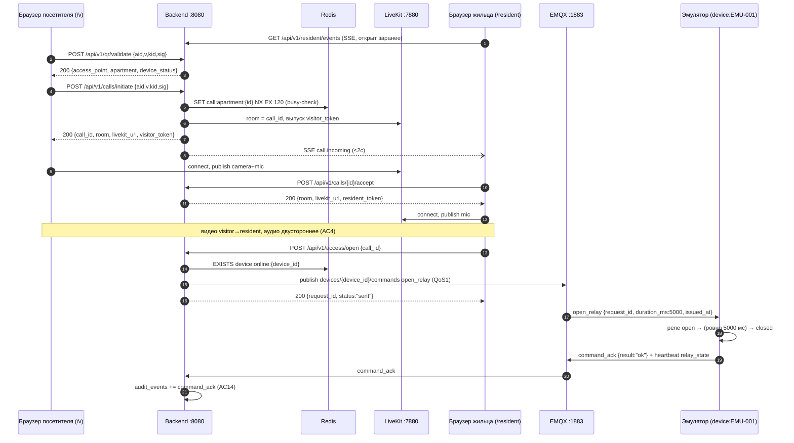

# API — Walking Skeleton (REST + SSE)

Backend: `http://localhost:8080`. Все ответы — JSON, время — UTC ISO 8601 (`Z`). Аутентификации в skeleton нет (анти-скоуп). Документ описывает намерение (написан до кода); UUID в примерах — канонические фикстуры из [architecture.md](architecture.md).

## Сводка эндпоинтов

| Метод | Путь | Назначение | Успех | Ошибки |
|---|---|---|---|---|
| GET | `/health` | Живость сервиса + зависимости | 200 | — |
| POST | `/api/v1/qr/validate` | Валидация QR-параметров | 200 | 400 `INVALID_QR`, 400 `VALIDATION_ERROR` |
| POST | `/api/v1/calls/initiate` | Начать звонок (комната LiveKit + токен посетителя) | 200 | 400 `INVALID_QR`, 409 `CALL_IN_PROGRESS` |
| POST | `/api/v1/calls/{id}/accept` | Жилец принимает звонок | 200 | 404 `CALL_NOT_FOUND` |
| POST | `/api/v1/calls/{id}/cancel` | Посетитель отменяет звонок | 204 | 404 `CALL_NOT_FOUND` |
| POST | `/api/v1/calls/{id}/end` | Завершить звонок (любая сторона) | 204 | 404 `CALL_NOT_FOUND` |
| GET | `/api/v1/resident/events` | SSE-поток событий жильца | 200 (stream) | — |
| POST | `/api/v1/access/open` | Команда открытия двери (только после accept) | 200 | 404 `CALL_NOT_FOUND`, 409 `CALL_NOT_ACCEPTED`, 503 `DEVICE_OFFLINE` |
| GET | `/api/v1/devices` | Список устройств со статусом | 200 | — |
| GET | `/api/v1/audit/events?limit=N` | Последние события аудита | 200 | — |

## Формат ошибок (ТЗ §13.1)

Единый конверт для всех ошибок:

```json
{
  "error": {
    "code": "DEVICE_OFFLINE",
    "message": "Device is offline, door cannot be opened remotely",
    "request_id": "9c1b7a3e-5f20-4d55-8b1a-2e6f0c4d7a91"
  }
}
```

| Код | HTTP | Когда |
|---|---|---|
| `INVALID_QR` | 400 | Битая/чужая подпись, неизвестный `kid`, неактивная точка, неизвестный `aid` |
| `VALIDATION_ERROR` | 400 | Некорректное тело запроса (отсутствуют обязательные поля и т.п.) |
| `CALL_NOT_FOUND` | 404 | `call_id` не существует или сессия истекла (TTL 120с) |
| `CALL_NOT_ACCEPTED` | 409 | Открытие двери до того, как жилец принял звонок (сессия в состоянии `ringing`). Дверь открывается только после `accept` (security M1) |
| `CALL_IN_PROGRESS` | 409 | Квартира занята другим активным звонком |
| `DEVICE_OFFLINE` | 503 | Прямое открытие невозможно: нет presence-ключа устройства. Для сценария **звонка** offline не блокирует — только warning (ТЗ §5.4, §13.4) |
| `RATE_LIMIT` | 429 | Превышен лимит частоты на публичных POST (30 req/мин на IP): `qr/validate`, `calls/initiate`, `access/open` (ТЗ §5.6) |
| `INTERNAL` | 500 | Необработанная ошибка сервера |

`request_id` в конверте — идентификатор HTTP-запроса для корреляции с логами (не путать с `request_id` MQTT-команды).

## Эндпоинты

### GET /health

AC1: 200, пока жив процесс; деградация видна по `deps`.

```json
{
  "status": "ok",
  "deps": { "postgres": "ok", "redis": "ok", "mqtt": "ok", "livekit": "ok" }
}
```

### POST /api/v1/qr/validate

Проверка HMAC-подписи: `message = aid + ":" + v + ":" + kid`, `sig = base64url(HMAC-SHA256(message, secret[kid]))[0:32]` (ТЗ §5.3). Сравнение — константное по времени.

Запрос:

```json
{
  "aid": "55555555-5555-5555-5555-555555555555",
  "v": "1",
  "kid": "dev1",
  "sig": "oRnZ1qQnxcI1GrLWAmBYrmVIH__CG-K6"
}
```

Ответ 200 (устройство online):

```json
{
  "access_point": { "public_id": "55555555-5555-5555-5555-555555555555", "label": "Подъезд №1" },
  "apartment": { "id": "33333333-3333-3333-3333-333333333333", "number": "1" },
  "device_status": "online"
}
```

Ответ 200 (устройство offline — E1; звонок НЕ блокируется):

```json
{
  "access_point": { "public_id": "55555555-5555-5555-5555-555555555555", "label": "Подъезд №1" },
  "apartment": { "id": "33333333-3333-3333-3333-333333333333", "number": "1" },
  "device_status": "offline",
  "warning": "Устройство временно недоступно. Вы можете позвонить жильцу — он откроет дверь, когда связь восстановится."
}
```

Ответ 400 — `INVALID_QR` (E6). Причина (битая подпись / неизвестный kid / неактивная точка) не раскрывается клиенту, пишется только в лог backend (`qr_validation_failed`).

### POST /api/v1/calls/initiate

Повторяет валидацию QR (не доверяет клиенту), затем: busy-check квартиры (Redis `SET NX EX 120`), создание LiveKit-комнаты `room = call_id`, выпуск токена посетителя (granты: publish camera+mic — ТЗ §6.1), сигнал жильцу через SSE ≤2с (AC3). Аудит: `call_initiated`.

Запрос — тот же, что у `qr/validate`:

```json
{
  "aid": "55555555-5555-5555-5555-555555555555",
  "v": "1",
  "kid": "dev1",
  "sig": "oRnZ1qQnxcI1GrLWAmBYrmVIH__CG-K6"
}
```

Ответ 200:

```json
{
  "call_id": "b7e2a4c8-1f3d-4e5a-9c6b-8d7f0a1b2c3d",
  "room": "b7e2a4c8-1f3d-4e5a-9c6b-8d7f0a1b2c3d",
  "livekit_url": "ws://localhost:7880",
  "visitor_token": "<LiveKit JWT>",
  "device_status": "online"
}
```

Ответ 409 — `CALL_IN_PROGRESS` (E5): квартира занята активным звонком (ключ `call:apartment:{apartment_id}` существует в Redis).

### POST /api/v1/calls/{id}/accept

Жилец принимает звонок. Выпускается токен жильца (гранты: publish **только mic**, subscribe — ТЗ §6.1). Остальным подписчикам SSE уходит `call.accepted`. Аудит: `call_accepted`.

Ответ 200:

```json
{
  "room": "b7e2a4c8-1f3d-4e5a-9c6b-8d7f0a1b2c3d",
  "livekit_url": "ws://localhost:7880",
  "resident_token": "<LiveKit JWT>"
}
```

Ответ 404 — `CALL_NOT_FOUND`: неизвестный `call_id` или сессия истекла.

### POST /api/v1/calls/{id}/cancel • POST /api/v1/calls/{id}/end

`cancel` — посетитель отменил до ответа (жильцу уходит SSE `call.cancelled`); `end` — завершение установленного звонка любой стороной. Оба: **204 No Content**, комната LiveKit закрывается, busy-ключ квартиры снимается. 404 — `CALL_NOT_FOUND`.

### GET /api/v1/resident/events (SSE)

`Content-Type: text/event-stream`. В skeleton поток отдаёт события единственной захардкоженной квартиры (без auth). Реализация backend — за интерфейсом `Notifier` (см. [architecture.md](architecture.md)). Keep-alive: комментарий `: ping` каждые 15с. Переигровка пропущенных событий (`Last-Event-ID`) не поддерживается — клиент после реконнекта опирается на текущее состояние.

```
: ping

event: call.incoming
data: {"call_id":"b7e2a4c8-1f3d-4e5a-9c6b-8d7f0a1b2c3d","access_point_label":"Подъезд №1","apartment_id":"33333333-3333-3333-3333-333333333333"}

event: call.cancelled
data: {"call_id":"b7e2a4c8-1f3d-4e5a-9c6b-8d7f0a1b2c3d"}

event: call.accepted
data: {"call_id":"b7e2a4c8-1f3d-4e5a-9c6b-8d7f0a1b2c3d"}
```

| Событие | Payload | Когда |
|---|---|---|
| `call.incoming` | `{call_id, access_point_label, apartment_id}` | Посетитель инициировал звонок (≤2с от initiate — AC3) |
| `call.cancelled` | `{call_id}` | Посетитель отменил / сессия истекла |
| `call.accepted` | `{call_id}` | Звонок принят (для остальных открытых вкладок жильца) |

### POST /api/v1/access/open

Проверки: звонок существует и активен (иначе 404), presence устройства в Redis (иначе 503 — AC12). Затем publish MQTT-команды `open_relay` в `devices/{device_id}/commands` (QoS1, payload — см. [firmware/docs/PROTOCOL.md](../../firmware/docs/PROTOCOL.md)); актуация ≤1с (AC5). Аудит: `door_open_requested`; при получении подтверждения устройства — `command_ack`.

Запрос:

```json
{ "call_id": "b7e2a4c8-1f3d-4e5a-9c6b-8d7f0a1b2c3d" }
```

Ответ 200 (`request_id` — UUID MQTT-команды, по нему матчится `command_ack` в аудите):

```json
{ "request_id": "7f9c24e5-0d2b-4a1a-9b6e-3f8a2c5d1e07", "status": "sent" }
```

Ответ 503 — `DEVICE_OFFLINE` (E1); ответ 404 — `CALL_NOT_FOUND`; ответ 409 — `CALL_NOT_ACCEPTED`, если звонок ещё не принят жильцом (сессия в состоянии `ringing`). Дверь открывается только после `POST /calls/{id}/accept` — это гарантирует, что доступом управляет жилец, а не владелец QR (security M1).

### GET /api/v1/devices

`status` — производное от Redis-presence (`device:online:{id}`, TTL 90с — AC9), не колонка БД.

```json
{
  "devices": [
    {
      "id": "66666666-6666-6666-6666-666666666666",
      "serial": "EMU-001",
      "access_point_id": "44444444-4444-4444-4444-444444444444",
      "type": "emulator",
      "firmware_version": "emu-0.1.0",
      "status": "online",
      "last_seen_at": "2026-07-07T10:00:00Z"
    }
  ]
}
```

### GET /api/v1/audit/events?limit=N

Последние события append-only таблицы `audit_events`, новые первыми. `limit` — по умолчанию 50, максимум 500. Минимальный набор событий skeleton (AC14): `call_initiated`, `call_accepted`, `door_open_requested`, `command_ack`, `fail_open_activated` (+ `fail_open_deactivated`, `call_cancelled`, `call_ended`, `command_rejected`).

```json
{
  "events": [
    {
      "id": 42,
      "event_type": "command_ack",
      "occurred_at": "2026-07-07T10:00:01Z",
      "actor": "device:EMU-001",
      "apartment_id": "33333333-3333-3333-3333-333333333333",
      "access_point_id": "44444444-4444-4444-4444-444444444444",
      "device_id": "66666666-6666-6666-6666-666666666666",
      "call_id": "b7e2a4c8-1f3d-4e5a-9c6b-8d7f0a1b2c3d",
      "request_id": "7f9c24e5-0d2b-4a1a-9b6e-3f8a2c5d1e07",
      "management_company_id": "11111111-1111-1111-1111-111111111111",
      "metadata": { "result": "ok" }
    }
  ]
}
```

## Sequence-диаграмма happy path


